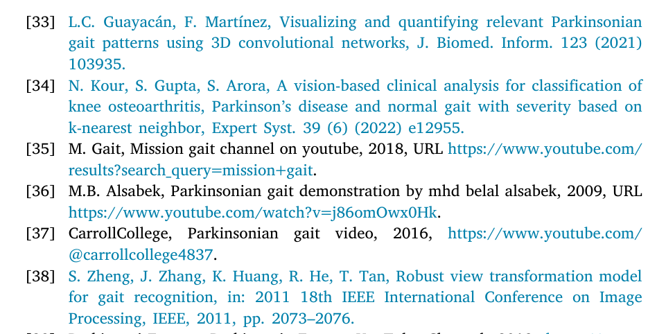
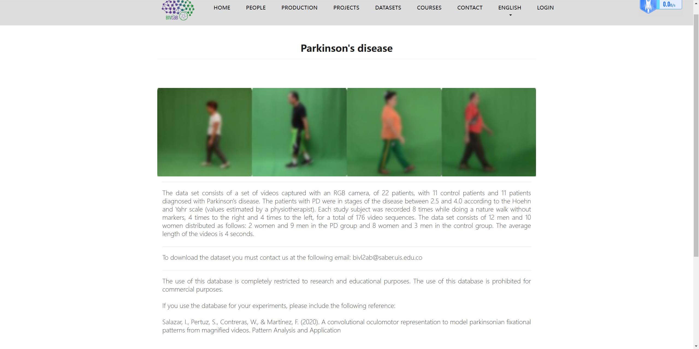
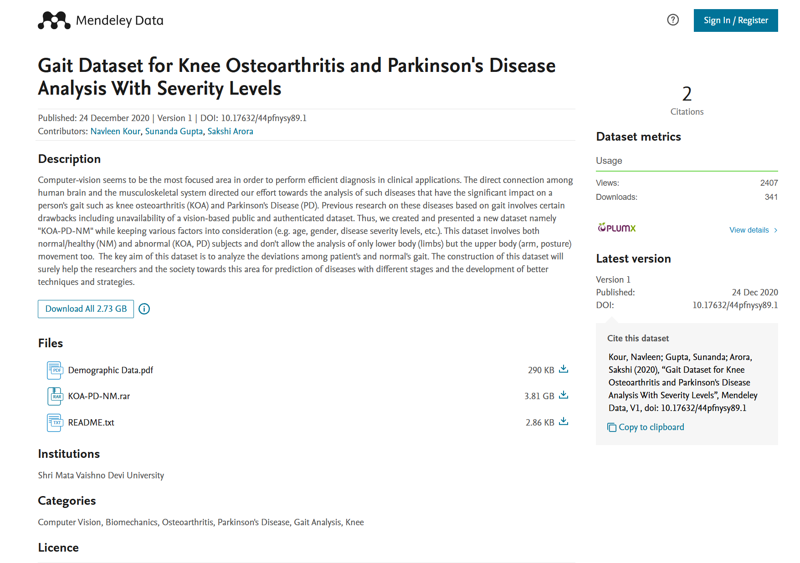
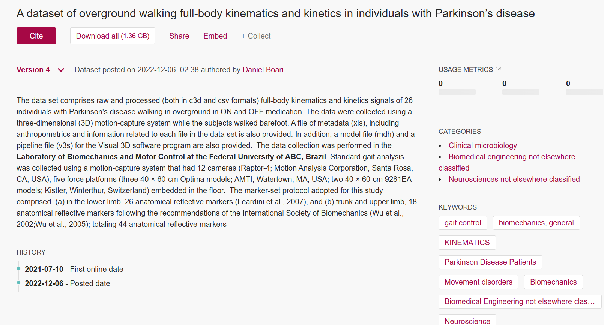
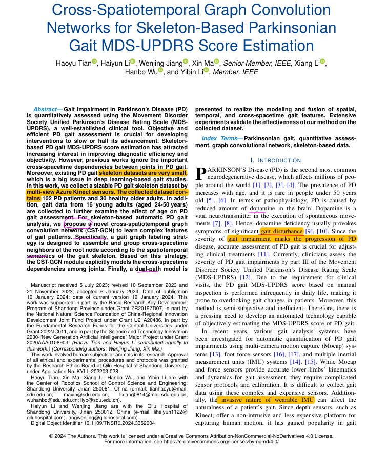
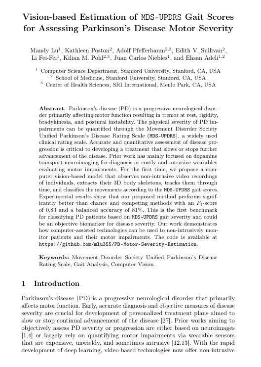
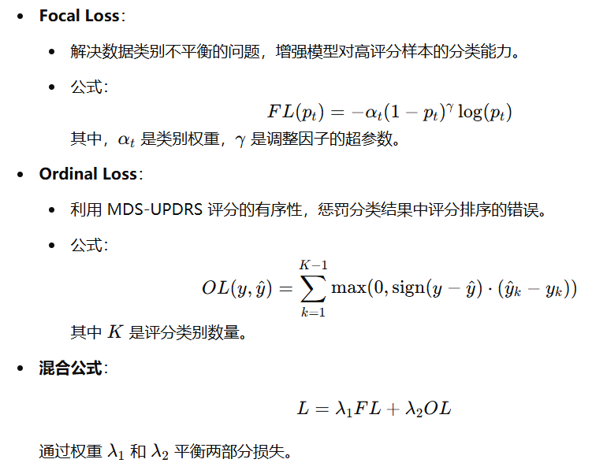
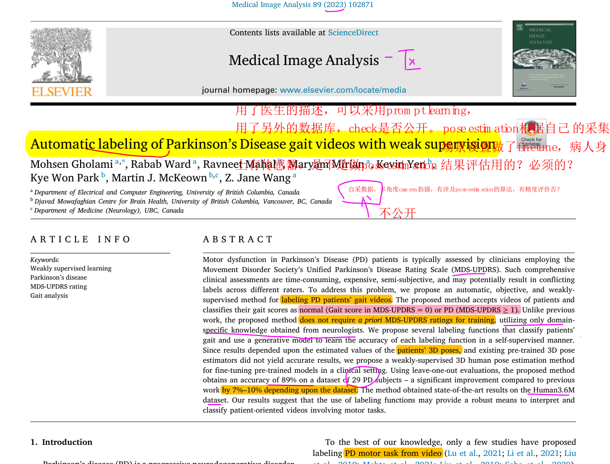
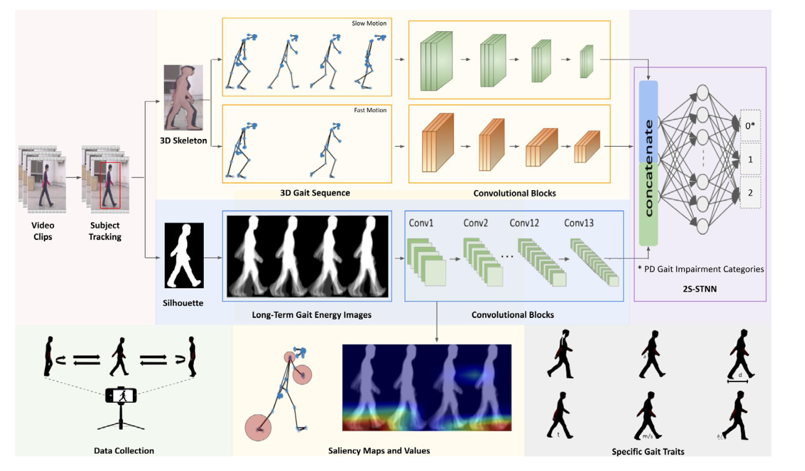
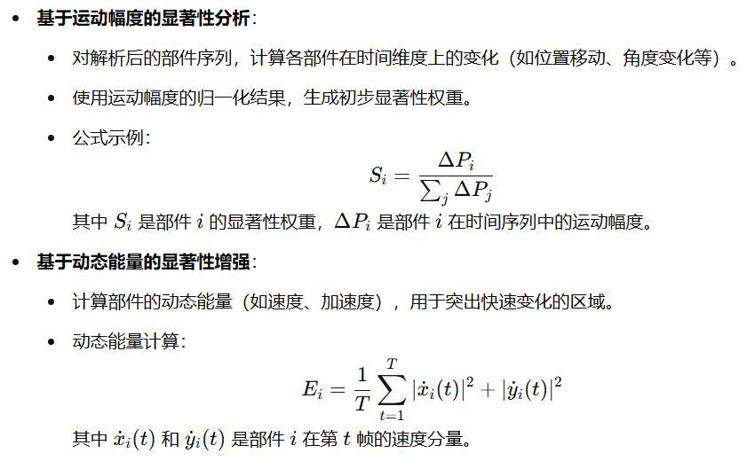

# 最近的研究方向

* 应用方向较为广泛，是大势所趋，**不用局限于步态本身，可以多关注其应用**

* 老师提议可以研究**帕金森识别方向**

  

# 要做的工作

## 阅读论文

* 对于数据集，**弄清楚以下几点**：

  1. 数据**是否公开可下载**（这是首先要弄清楚的）
  2. 数据本身的**形态**
  3. 数据的**数量**
  4. 数据**标签的特点**

* 阅读论文，了解**帕金森研究的<ins>现状</ins>**、**使用的方法以及它们用来解决什么痛点**等
  * 阅读的目标：了解要解决的痛点问题，方法该如何设计，从而提供思路
  

## 结合之前学习的内容

* 思考：*是否可以将之前看的ParsingGait应用到帕金森的研究中？*
  * 帕金森具有特定的步态特征：小步、步幅不一致等
  * ParsingGait可以细化步态特征，满足局部解析的要求
    * 并且**更具有解释性，知道哪些部位更加重要**
  * **因此，ParsingGait可以深入分析下肢例如膝关节、踝关节运动轨迹来与帕金森的识别结合**
* 可以与医生沟通，了解帕金森的一些病理特点，如手脚颤抖、以及严重等级的划分等
  * 思考：*如何提取这些相关的特征进行识别？*---->读论文之后补充
    * 步长、步频、步宽等---->**长期步态能量图**
    * 手脚颤抖：鉴于手脚一般来说在步态序列中较小，该如何提取这样的微小特征？
      * *多尺度卷积？*--->**SCL监督对比学习策略**

### 指尖敲击的对比学习（CS_STIGCN）

解决的主要问题：

* 低类别特异性问题：指尖敲击的**动作幅度较小，不同类别差异细微**
  * 采用**监督对比学习策略（SCL）**，增强类内特征一致性和类间特征区分性
  * 显著提高了精细化分类任务的精度
* 特征区分性不足：关节位置和运动特征存在**冗余信息**
  * 提出**多流联合稀疏学习机制MJSL**，自适应减少冗余特征的权重，提升区分性
    * 冗余：位置特征流和运动特征流之间的冗余
    * 让一些不重要的特征变成接近零，从而减小噪声

可能的改进方向：

* 采用的是单模态数据，可能无法充分捕捉复杂的运动特征
  * 考虑引入多模态（轮廓）
* 除了监督对比学习，考虑引入*自监督任务*：挖掘无标签数据的潜力
  * 时间扰动、空间扰动等增强，生成伪标签样本，进行自监督对比学习

### 步态分析评估（2S-STNN）

相比于上一篇，它更多关注整体的步态分析，而非局部，并且是多模态的，结合骨架与轮廓，强调全局轮廓信息和局部关节特征的互补性。

* **双流网络架构**，即骨架流和轮廓流
  * 骨架流包括关节距离和快慢节奏的全局运动特征，使用**DD-net**提取
    * DD-net对于人体的层次结构信息可能建模不足
  * 两个流进行独立处理之后使用**MLP**进行融合
    * 可以考虑*对多个模态之间的交互进行更进一步的捕捉*？在模态间共享信息
      * **多模态注意力机制**：确保两种模态的互补性
* **显著性分析模块**：使用Grad-CAM生成显著性图，对影响分类结果的关健身体区域进行定位，解释模型决策
* 捕捉**跨步态周期的变化**：使用长时间步态能量图LT_GEI，进行帧间平均，提取全局动态特征，*如步频、步宽*
* 使用统计方法对提取的21种不同步态特征分析不同的步态障碍程度

* 研究的特征：

  - 上半身特征：
    1. 手臂摆动角度：测量肩部与肘部之间的水平与垂直距离变化（左臂、右臂、总摆动幅度，以及摆动不对称性）。
    2. 颈部前倾角：头部（鼻部）与颈部之间的水平和垂直距离变化。
    3. 背部前倾角：颈部与髋部中点的倾斜角度。

  - 下半身特征：
    1. 步幅（Step Length）：两脚后跟之间的最大距离，包括左脚步幅、右脚步幅以及步幅不对称性。
    2. 步幅持续时间（Step Duration）：两脚在最大距离分开时的时间间隔（左脚、右脚及持续时间不对称性）。
    3. 步行速度（Walking Speed）：单位时间内行走的距离。
    4. 脚后跟触地角度（Heel Strike Angle）：脚后跟首次触地时，脚部与地面的夹角。
    5. 脚尖离地角度（Toe-Off Angle）：脚尖离地时，脚部与地面的夹角。

* 发现以下特征的重要性：

  * 步幅长度

  * 步行速度

  * 颈部前倾角

  * 步态的不对称性

---

0107总结：

1. 先看论文数据集！如果用不了的，不要看。浪费时间。

   再次强调，看论文最需要重视的几点：（有优先级顺序）：

   1. 数据集**是否公开**
   2. 数据集的**标签**
   3. 解决的问题
   4. 用了什么方法

2. 在思考方法的改进的时候，先思考自己已经学习到的方法如何进行融合。而不是先去思考自己不熟悉、没看过论文的方法，例如*多模态共享信息*，这个之前没研究过，也不知道该怎么做；先思考之前看过的Parsing Gait具体要怎么做

3. 老师提议可以用ParsingGait的可解释性来完成第二篇论文的着重标识部位的要求。

4. 直接让kimi或者其他ai阅读论文，减少时间消耗！

---

0114：

### 0107-两篇论文所使用的数据集

###### Assessing gait dysfunction severity in Parkinson’s Disease using 2-Stream Spatial–Temporal Neural Network

| 文献                                                         | 数据库链接                                      | 预览                                                         | 是否可下载           |
| ------------------------------------------------------------ | ----------------------------------------------- | ------------------------------------------------------------ | -------------------- |
| [33]Visualising and quantifying relevant parkinsonian gait patterns using 3D convolutional network | https://bivl2ab.uis.edu.co/datasets             |  | 需要邮件联系         |
| [34]A vision-based clinical analysis for classification of knee osteoarthritis, Parkinson's disease and normal gait with severity based on k-nearest neighbour | https://data.mendeley.com/datasets/44pfnysy89/1 |  | 可直接下载（2.73GB） |
| [38]ROBUST VIEW TRANSFORMATION MODEL FOR GAIT RECOGNITION    | CASIA数据库                                     |                                                              |                      |

其他的几项均为从Youtube上获取的视频。是可以下载的。

###### A public data set of walking full-body kinematics and kinetics in individuals with Parkinson’s disease

[数据库](https://figshare.com/articles/dataset/A_dataset_of_overground_walking_full-body_kinematics_and_kinetics_in_individuals_with_Parkinson_s_disease/14896881)可直接下载，1.36GB.

### Cross-Spatiotemporal Graph Convolution Networks for Skeleton-Based Parkinsonian Gait MDS-UPDRS Score Estimation

* 数据集：PD步态骨架数据集
  * 由于隐私保护原因，不公开
  * 标签：
    - **MDS-UPDRS评分**：102名PD患者的步态由两位专家进行MDS-UPDRS评分，健康对照组的步态默认评分为0。
    - **评分范围**：0（无步态障碍）到4（无法独立行走）。本研究仅收集了评分为0、1和2的PD患者的步态数据，因为评分为**3和4的患者跌倒风险较高。**
* MDS分数的评估方法：由两位专家进行评分
* 模型贡献：CST-GCN，跨时空卷积网络 + 双路径模型
  * 跨时空卷积网络：使用一个**跨时空图标记函数**学习步态数据中关节之间的复杂跨时空依赖性--->与*ParsingGait的跨部位头建模相似*
    * 与**CTR-GCN**的区别：CTR-GCN主要关注节点在不同时间步之间的关系，即时间维度上的依赖性。它通过图卷积操作来捕捉节点随时间的变化，但可能不会像CST-GCN那样深入地考虑不同节点之间的跨时空交互。
  * Dual-Path GCN Blocks
    - FST-GCN路径
      - **空间GCN层**：通过图标记过程将邻居节点分组，提取空间特征。
      - **1x1卷积层**：用于特征降维和升维。
      - **分组TCN层**：用于捕捉时间依赖性，核大小为1x7，时间步长为1。
    - CST-GCN路径
      - **CST-GCN层**：通过跨时空图标记函数提取跨时空特征。
      - **1x1卷积层**：用于特征降维和升维。

### Vision-based Estimation of MDS-UPDRS Gait Scores for Assessing Parkinson’s Disease Motor Severity

* 数据集：
  * **临床数据集**：包含30名PD患者的视频记录，这些患者在未服药状态下进行了MDS-UPDRS步态测试。视频记录的长度从17秒到54秒不等，帧率为30帧/秒。--->不公开
  * **CASIA步态数据库A**：为了增强正常对照组（即评分0），从公开可用的CASIA步态数据库A中包含了20名非PD参与者的视频样本。-->公开

* 模型：

  * 使用SPIN从视频中提取3D骨架数据

  * 设计了两种运动特征用于捕捉帕金森病步态的动态模式：

    - **关节集合距离（JCD）**：计算骨架关节之间的距离矩阵，用于表示步态的几何结构。
    - **双尺度运动特征（Two-scale Motion Features）**：通过比较不同时间间隔的骨架位置变化，捕捉慢速和快速运动的动态特性。

  * **步态评分分类模块**：

    - 使用轻量级的 **OF-DDNet**（Ordinal-Focal Distance-Difference Network）对步态评分进行分类。
    - 包括两个子模块：
      - **TCNN（Temporal Convolutional Neural Network）**：用于处理时间序列数据。
      - **DD-Net（Distance-Difference Network）**：专注于挖掘关节间距离变化模式。

  * 混合损失函数

    

    

### Automatic labeling of Parkinson’s Disease gait videos with weak supervision

* 使用的**数据集**：
  * 自采数据库，不公开
  * **Human3.6M 和 MPI-INF-3DHP** 数据集是公开的，可用于评估模型性能。
* 模型贡献：弱监督学习+基于领域知识的标注函数（根据医生描述设计）
  * 可以通过prompt learning将这些描述转化为自然语言提示，结合步态特征或其他输入，指导模型进行分类或生成更精确的预测。*可以用来设计标注函数*？

### Gait Patterns as Biomakers: A video-based Approach for Classifying Scoliosis

数据集论文。

* 数据集：公开
* 为什么采集正面而非侧面？
  * 脊柱侧凸可能更多导致不对称的特征，这些特征在正面视角中更为明显？

## 目前的想法

从RGB视频帧中提取Gait Parsing Sequence代替Silhouette流，GPS采用单通道掩模，即在每一帧的掩模中，对每个像素所属的部位以序号进行标记。（由于GPS支持细粒度、粗粒度的分割，对于整体的对称性分析可能更有帮助，同时提高可解释性）

* 对于能量图：可以采用与GEI相同的方法，对多个帧的掩模进行时间平均，得到类似于上面Long-Term Gait Energy Images的掩模的版本，这样可以保留全局动态特征。

* GCN处理部件间的关系，生成特征向量，然后作为MLP的输入，与骨骼特征融合

  * 可以引入**注意力权重**，对二者进行加权融合
    * *可以考虑使用[上述论文中](#above)提出的**标注函数?**作为注意力权重的一部分*
  * 引入[上文中提到的JCD](#JCD)，或者可以更好地建模捕捉对称细节？

* 对于显著性图，考虑两种生成方案：

  

* *损失函数的设计？*

## 写文档的注意事项

* 不要只是记录，要把自己的idea写下来，可以不用将具体实现方法写下来，可先留白
* 结构要清晰：注明之前的工作、将要做的工作